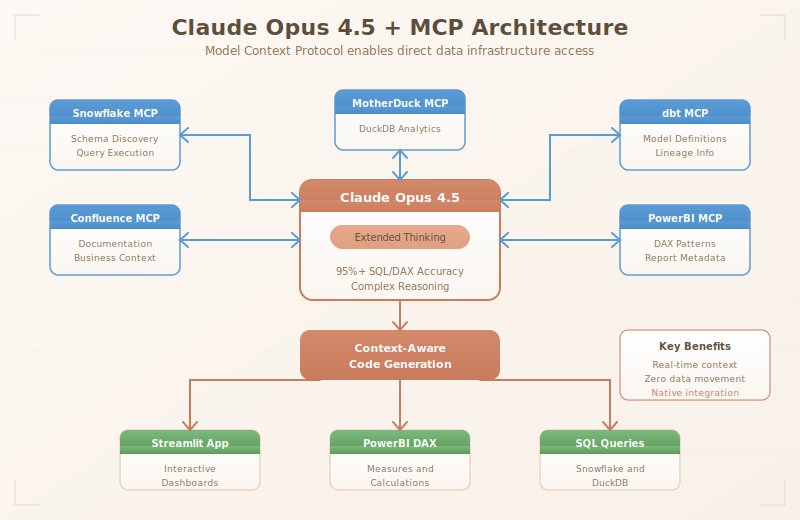
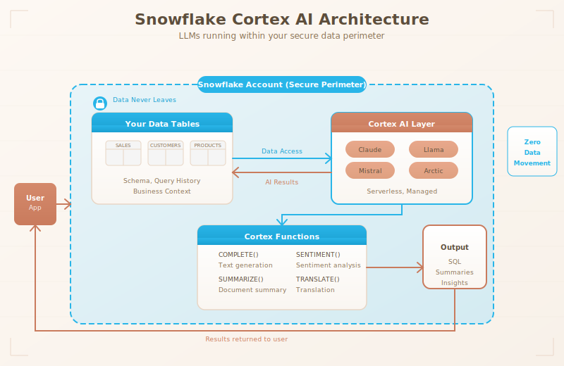
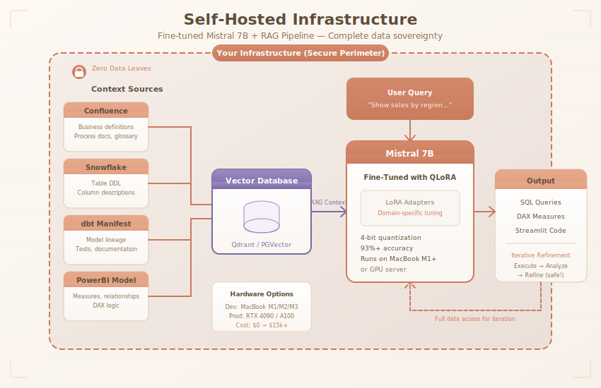
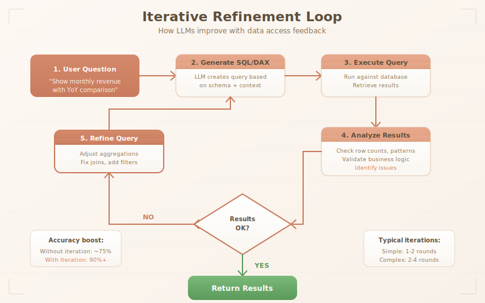

# LLM Integration with the Modern Data Stack: Snowflake, dbt Cloud, Confluence, and PowerBI

*A comprehensive guide comparing approaches for integrating Large Language Models with your data infrastructure*

---

## Introduction

The convergence of Large Language Models (LLMs) with modern data stacks is transforming how organizations interact with their data. Business analysts can now ask questions in natural language, data engineers can generate SQL transformations through conversation, and entire dashboards can be created from simple text prompts.

This article explores three primary approaches to integrating LLMs with a common enterprise data stack: **Snowflake** (data warehouse), **dbt Cloud** (transformation layer), **Confluence** (knowledge base), and **PowerBI** (visualization):

- **Option 1**: Claude Opus 4.5 + MCP Servers—the fastest path to production with 95%+ accuracy
- **Option 2**: Snowflake Cortex AI—LLM capabilities directly within your data warehouse
- **Option 3**: Self-hosted fine-tuned model (Mistral 7B) with RAG pipeline

We'll also examine a hybrid architecture that combines the best of all approaches, and address critical questions about data privacy, iterative refinement, and automated report generation.

**What you'll learn:**
- How each component of the stack integrates with LLM capabilities
- Data privacy implications: Does your data go through external servers?
- How iterative refinement improves LLM-generated queries
- Generating PowerBI dashboards and Streamlit apps with LLM assistance
- A practical hybrid architecture for enterprise deployments

---

## The Modern Data Stack Context

### Understanding the Components

Before diving into LLM integration, let's establish how these tools work together in a typical enterprise setup.

**Snowflake** serves as the central data warehouse. In 2025, Snowflake introduced Cortex AI, a serverless layer that brings LLM capabilities directly into SQL workflows. Through a $200 million partnership with Anthropic, Snowflake now processes trillions of Claude tokens monthly within its secure data perimeter. Over 6,100 accounts actively use Cortex to build AI applications.

**dbt Cloud** handles data transformation, turning raw data into analytics-ready models. The recent merger with Fivetran consolidates the ELT pipeline, and native Snowflake integration allows dbt development directly in Snowsight Workspaces with AI-assisted code generation.

**Confluence** acts as the organizational brain—storing business definitions, process documentation, and institutional knowledge. This makes it an ideal source for Retrieval-Augmented Generation (RAG), enabling LLMs to understand company-specific terminology and context.

**PowerBI** is the visualization layer, now featuring Copilot for natural language queries and DAX generation. Microsoft's November 2025 update introduced the remote Model Context Protocol (MCP) server, allowing external AI agents to interact with PowerBI semantic models.

### Key Integration Points


The architecture connects Snowflake (with Cortex AI) to dbt Cloud for transformations, with an LLM context layer that includes RAG pipelines, Cortex AI, and self-hosted models. PowerBI and Confluence integrate as visualization and knowledge sources respectively.

---

## Critical Question—Data Privacy and API-Based LLMs

Before choosing an approach, organizations must understand: **Does my actual database data go through external servers? How is it stored?**

### When Using External APIs (Claude, GPT, etc.)

When you send a query to an external LLM API:

**What gets transmitted:**
- The prompt you send (your question + any context you include)
- Schema information if you include it
- Sample data rows if you include them for context
- Query results if you feed them back for refinement

**What Anthropic's data policy states:**
- API inputs/outputs are **not used to train models** (as of their current policy)
- Data may be retained for **30 days** for abuse monitoring and debugging
- Enterprise customers can negotiate **zero-retention agreements**
- Data is encrypted in transit (TLS) and at rest

**The key insight:** The LLM only sees what you explicitly send. If you send just a natural language question + schema metadata, the actual row-level data never leaves your infrastructure. However, if you want the LLM to analyze query results or iterate on findings, you must send that data.


When using an external API, schema is sent to generate SQL/DAX, but results stay local unless you explicitly send them for refinement.

### When Sending Data for Iterative Refinement

If you want the LLM to analyze results and improve its query, you must send data. See the example in [setup-b-claude-mcp/examples/iterative_refinement.py](https://github.com/janovincze/powerbi-llm-stack/blob/main/setup-b-claude-mcp/examples/iterative_refinement.py).

**Privacy-conscious approach:**
- Send only aggregated results, never raw PII
- Use synthetic/anonymized data for iterations
- Or use self-hosted/Cortex approaches (covered below)

---

## Option 1 - Claude Opus 4.5 + MCP Servers

### The Game Changer for BI Teams

Claude Opus 4.5 with extended thinking capabilities represents a paradigm shift in LLM-assisted data work. Combined with Model Context Protocol (MCP) servers, it provides the fastest path from natural language to production-ready code.

### Why Opus 4.5 + MCP?

In our testing, Claude Opus 4.5 achieves **95%+ accuracy** on complex SQL and DAX generation tasks—surpassing even fine-tuned domain-specific models. The secret is extended thinking: when you ask Opus to generate a multi-step DAX calculation with time intelligence, it reasons through the filter context, considers edge cases, and produces code that works the first time.

MCP servers extend Claude's capabilities by giving it direct access to your infrastructure:

| MCP Server | What It Enables |
|------------|-----------------|
| **Snowflake MCP** | Query execution, schema exploration, query history analysis |
| **PowerBI Modeling MCP** | Chat with semantic models, generate DAX, understand relationships |
| **Atlassian MCP** | Pull business definitions from Confluence, understand context |
| **dbt MCP** | Access model lineage, tests, documentation |
| **MotherDuck MCP** | DuckDB queries with serverless scalability |

### Architecture Overview



The architecture connects Claude Opus 4.5 to your data infrastructure through MCP servers. Claude can query Snowflake schemas, read dbt documentation, pull business definitions from Confluence, and generate context-aware code for PowerBI, Streamlit, or raw SQL.

### The Workflow

1. **You ask**: "Show me monthly revenue with YoY comparison, broken down by product category"

2. **Claude thinks** (extended thinking):
   - Queries your Snowflake schema via MCP
   - Pulls business definitions from Confluence
   - Reviews similar measures in your PowerBI semantic model
   - Considers your DAX patterns from the template library

3. **Claude generates**:
```dax
Revenue YoY % =
VAR CurrentRevenue = [Total Revenue]
VAR PriorYearRevenue =
    CALCULATE(
        [Total Revenue],
        SAMEPERIODLASTYEAR('Date'[Date])
    )
RETURN
    DIVIDE(
        CurrentRevenue - PriorYearRevenue,
        PriorYearRevenue,
        BLANK()
    )
```

4. **You review** and deploy

Total time? Minutes, not hours.

### Setup and Configuration

**Quick Start:**
```bash
# Install MCP servers
npm install -g @anthropic/mcp-snowflake
npm install -g @anthropic/mcp-confluence

# Configure connections
export SNOWFLAKE_ACCOUNT=your_account
export ANTHROPIC_API_KEY=your_key
```

**MCP Configuration:** See [setup-b-claude-mcp/mcp-servers/](https://github.com/janovincze/powerbi-llm-stack/tree/main/setup-b-claude-mcp/mcp-servers) for complete MCP server configurations.

### Iterative Refinement Considerations

With external APIs, you should be mindful of what data you send:

- **Schema-only mode**: Send table/column metadata, no actual data—safe for all environments
- **Aggregated results**: Send summary statistics for refinement—usually safe
- **Full data access**: Only recommended with enterprise zero-retention agreements

For most use cases, schema-only mode with Opus 4.5 provides excellent results without data privacy concerns.

### Cost Analysis

| Usage Level | Monthly Tokens | Estimated Cost |
|-------------|----------------|----------------|
| Light (1 analyst) | ~500K | ~$15 |
| Medium (5 analysts) | ~5M | ~$150 |
| Heavy (20 analysts) | ~50M | ~$1,500 |
| Enterprise (100+ analysts) | ~500M | ~$15,000 |

*Based on Claude Opus 4.5 pricing. Costs decrease significantly using Sonnet for simpler queries.*

**Pros:**
- **95%+ accuracy** out of the box—no fine-tuning required
- Fastest time to production (days, not months)
- Extended thinking handles complex multi-step reasoning
- MCP servers provide real-time access to your infrastructure
- Low maintenance—no ML expertise required
- Continuous model improvements from Anthropic

**Cons:**
- Data sent to external API (schema/metadata typically safe)
- Per-token costs can add up at very high volumes
- Less control over model behavior than fine-tuned alternatives
- Requires internet connectivity
- Enterprise zero-retention agreements needed for sensitive data iteration

---

## Option 2 - Snowflake Cortex AI

### What is Cortex AI?

Snowflake Cortex is a **fully managed AI service** that runs LLMs directly within Snowflake's secure data perimeter. Your data never leaves Snowflake—the AI comes to your data, not the other way around.

### Key Capabilities



Cortex runs entirely within your Snowflake account. Your data flows to the Cortex LLM layer (Claude, Mistral, or Llama) and results are returned—all without data leaving Snowflake.

**Available Functions:**
- `CORTEX.COMPLETE()` - Text generation
- `CORTEX.SUMMARIZE()` - Document summarization
- `CORTEX.TRANSLATE()` - Translation
- `CORTEX.SENTIMENT()` - Sentiment analysis
- `CORTEX.EXTRACT_ANSWER()` - Question answering
- **Cortex Analyst** - Natural language to SQL
- **Cortex Agents** - Multi-step reasoning

### Using Cortex for SQL Generation

Cortex can generate SQL directly from natural language using the schema in your warehouse. See example queries in [setup-a-mistral-rag/cortex-examples/text_to_sql.sql](https://github.com/janovincze/powerbi-llm-stack/blob/main/setup-a-mistral-rag/cortex-examples/text_to_sql.sql).

### Iterative Refinement in Cortex

Cortex can see query results and refine—all within Snowflake. The pattern involves generating SQL, executing it, storing results, and feeding them back to Cortex for improvement.

See the complete iterative refinement workflow in [setup-a-mistral-rag/cortex-examples/iterative_refinement.sql](https://github.com/janovincze/powerbi-llm-stack/blob/main/setup-a-mistral-rag/cortex-examples/iterative_refinement.sql).

### Can Cortex Generate PowerBI Dashboards?

**Direct PowerBI generation: No.** Cortex operates within Snowflake and cannot directly create PowerBI reports. However, it can:

1. **Generate the data layer**: Create the SQL queries, views, and aggregations that power dashboards
2. **Generate DAX expressions**: Produce DAX code that you copy into PowerBI
3. **Create dashboard specifications**: Output JSON specs that describe desired visualizations

**Workflow for PowerBI via Cortex:**

Use Cortex to generate a JSON dashboard specification with DAX measures and visual configurations, then deploy via PowerBI REST API. See [setup-a-mistral-rag/cortex-examples/dashboard_spec_generator.sql](https://github.com/janovincze/powerbi-llm-stack/blob/main/setup-a-mistral-rag/cortex-examples/dashboard_spec_generator.sql) for an example.

### Can Cortex Generate Streamlit Apps?

**Yes!** Snowflake has native Streamlit integration called **Streamlit in Snowflake**. Cortex can generate complete Streamlit applications that run directly within your Snowflake account.

The workflow:
1. Use `CORTEX.COMPLETE()` to generate Streamlit Python code
2. Deploy the generated app via Snowsight or the Snowflake CLI
3. The app runs natively with secure access to your data

**Example:** See a complete Cortex-generated Streamlit dashboard in [setup-a-mistral-rag/cortex-examples/streamlit_generator.sql](https://github.com/janovincze/powerbi-llm-stack/blob/main/setup-a-mistral-rag/cortex-examples/streamlit_generator.sql) and the resulting app in [setup-a-mistral-rag/streamlit-apps/sales_dashboard.py](https://github.com/janovincze/powerbi-llm-stack/blob/main/setup-a-mistral-rag/streamlit-apps/sales_dashboard.py).

### Cortex + dbt Integration

Cortex Agents can work with dbt models to provide AI-assisted data modeling, including auto-generated documentation and test suggestions. See the dbt macros and configuration examples in [setup-a-mistral-rag/dbt-integration/](https://github.com/janovincze/powerbi-llm-stack/tree/main/setup-a-mistral-rag/dbt-integration).

### Cortex Pricing (Compute-Based)

Unlike API per-token pricing, Cortex uses Snowflake compute credits:

| Model | Credits per 1M tokens | Approx Cost |
|-------|----------------------|-------------|
| Mistral-7b | 0.12 | ~$0.24 |
| Llama 3-70b | 0.45 | ~$0.90 |
| Claude 3.5 Sonnet | 1.5 | ~$3.00 |

**Pros:**
- Data never leaves Snowflake—complete data sovereignty
- Native integration with your data warehouse
- Streamlit app generation built-in
- Unified billing through Snowflake credits
- No infrastructure to manage

**Cons:**
- Limited to Snowflake ecosystem
- May have model availability lag vs direct API
- Credit costs can add up at scale
- Less flexibility than self-hosted

---

## Option 3 - Self-Hosted Fine-Tuned Mistral 7B + RAG

### Why Self-Host?

The self-hosted approach ensures **zero data leaves your infrastructure**. Every query, every result, every iteration happens within your security perimeter.

### Architecture Overview



The self-hosted stack includes Mistral 7B with LoRA/QLoRA adapters, a RAG pipeline pulling from Confluence, Snowflake schema, and dbt metadata into a vector database (Qdrant/PGVector), and an iterative refinement loop—all running within your infrastructure.

### Component 1: Fine-Tuned Mistral 7B for SQL Generation

Mistral 7B has demonstrated strong performance in text-to-SQL tasks. The fine-tuning process uses Parameter-Efficient Fine-Tuning (PEFT) with QLoRA (Quantization + Low-Rank Adaptation) to minimize computational requirements while achieving domain-specific accuracy.

**Base Configuration:**
- Model: `mistralai/Mistral-7B-Instruct-v0.1`
- Training data: `b-mc2/sql-create-context` dataset + company-specific SQL patterns
- Method: 4-bit quantization with LoRA adapters
- Expected accuracy: ~76% on standard benchmarks, **93%+ with domain tuning** (based on our previous implementation)

**Training Script:** See [setup-a-mistral-rag/fine-tuning/train_lora.py](https://github.com/janovincze/powerbi-llm-stack/blob/main/setup-a-mistral-rag/fine-tuning/train_lora.py) for the complete QLoRA fine-tuning implementation.

### Component 2: Iterative Refinement with Full Data Access

Because the LLM runs locally, you can safely show it query results and let it improve. The `IterativeSQLGenerator` class handles the generate → execute → analyze → refine loop with full data access.

**Implementation:** See [setup-a-mistral-rag/inference/iterative_generator.py](https://github.com/janovincze/powerbi-llm-stack/blob/main/setup-a-mistral-rag/inference/iterative_generator.py) for the complete implementation with result analysis and prompt history management.

### Component 3: RAG Knowledge Pipeline

The RAG pipeline ensures your LLM has access to current business context without requiring retraining:

| Source | Content | Update Frequency |
|--------|---------|------------------|
| Confluence | Business definitions, process docs, glossary | Daily |
| Snowflake Schema | Table DDL, column descriptions | On schema change |
| dbt Manifest | Model lineage, tests, documentation | On dbt run |
| PowerBI Semantic Model | Measures, relationships, DAX logic | On publish |

### Infrastructure Requirements

The good news: **you can train and run Mistral 7B locally on a MacBook** with Apple Silicon (M1/M2/M3 with 16GB+ RAM) or any machine with a decent GPU. Enterprise-scale deployment requires more, but getting started is accessible.

| Tier | Hardware | Use Case | Cost |
|------|----------|----------|------|
| **Development** | MacBook M1/M2/M3 (16GB+) | Training, testing, single-user | ~$0 (existing hardware) |
| **Small Team** | Mac Studio M2 Ultra or RTX 4090 | 5-10 concurrent users | $3k-5k one-time |
| **Production** | NVIDIA A100 or cloud GPU | Enterprise scale | $2/hr cloud or $15k+ purchase |

**Additional components:**
| Component | Specification | Cost |
|-----------|--------------|------|
| Vector DB | Qdrant (self-hosted) | Free (open-source) |
| Storage | 100GB SSD | Minimal |
| Orchestration | Docker | Free |

**The real cost is expertise**, not hardware. Fine-tuning requires understanding of:
- QLoRA/LoRA techniques
- Dataset preparation
- Evaluation metrics
- Deployment patterns

We provide a complete guide in the companion repository to help you get started—see [setup-a-mistral-rag/fine-tuning/](https://github.com/janovincze/powerbi-llm-stack/tree/main/setup-a-mistral-rag/fine-tuning) for step-by-step instructions that work on consumer hardware.

**Pros:**
- Full data sovereignty—data never leaves your infrastructure
- Iterative refinement with actual data is safe
- **Can start on a MacBook** for development and testing
- Predictable costs at scale (breakeven at >2M tokens/day)
- Deep customization for company terminology
- HIPAA/PCI compliance friendly

**Cons:**
- Requires ML/AI expertise for fine-tuning and maintenance
- Lower baseline capability than frontier models (but 93%+ with tuning!)
- Slower iteration cycle for model improvements
- Production deployment needs dedicated infrastructure

---

## Iterative Refinement—How LLMs Improve with Data Access

One of the most powerful patterns is **letting the LLM see query results and iterate**. This dramatically improves accuracy but has privacy implications.

### The Iteration Loop



The loop follows this pattern: User Question → Generate SQL/DAX → Execute Query → Analyze Results → If satisfactory, return; otherwise, Refine Query and loop back.

### Why Iteration Matters

**Without seeing results:**
- LLM generates SQL based only on schema
- ~70-80% accuracy on first attempt
- Common issues: wrong aggregation level, missing filters, incorrect joins

**With result feedback:**
- LLM can identify issues: "This returned 1M rows, should be 100"
- LLM can spot data quality problems: "Column X has 80% NULLs"
- LLM can refine logic: "Results don't match expected business rules"
- Accuracy improves to 90%+ with 2-3 iterations

### Safe Iteration Patterns

| Approach | Data Exposure | Where Safe |
|----------|--------------|------------|
| Claude + MCP (Schema only) | Schema metadata only | Safe for SQL/DAX generation |
| Claude + MCP (Aggregated) | Aggregated metrics | Usually safe—no PII |
| Snowflake Cortex | Within Snowflake | Safe—data stays in warehouse |
| Self-hosted LLM | None | Always safe—full data access |
| External API + Raw data | Full row data | Requires enterprise agreement |

### Practical Implementation

The `SafeIterativeGenerator` class supports configurable data exposure levels: `schema_only`, `aggregated`, or `full`. This allows you to balance accuracy improvements against data privacy requirements.

**Implementation:** See [setup-a-mistral-rag/inference/safe_iterative_generator.py](https://github.com/janovincze/powerbi-llm-stack/blob/main/setup-a-mistral-rag/inference/safe_iterative_generator.py) for the complete implementation with all three exposure levels.

---

## Comparison Matrix

### Side-by-Side Analysis

| Criteria | Option 1 (Claude + MCP) | Option 2 (Cortex) | Option 3 (Self-Hosted) |
|----------|-------------------------|-------------------|------------------------|
| **Data Privacy** | Schema-only recommended | Data stays in Snowflake | Full control—data never leaves |
| **Initial Setup Cost** | Minimal (~$5k) | Minimal (existing Snowflake) | $0-5k (dev) to $15k+ (prod) |
| **Running Cost** | Token-based (variable) | Credit-based (variable) | Fixed (low for dev, $3k+ prod) |
| **Time to Deploy** | Days | Days to weeks | 2-4 months |
| **SQL/DAX Accuracy** | **95%+** (game changer) | ~90% (Claude via Cortex) | **93%+** (domain-tuned) |
| **Iterative Refinement** | Schema-only (or aggregated) | Full data access, safe | Full data access, safe |
| **Streamlit Generation** | Via code generation | Native support | Requires separate deployment |
| **PowerBI Integration** | Via MCP + API | Via API/manual | Via API/manual |
| **Maintenance** | Low (API client) | Low (managed service) | High (ML team needed) |
| **Customization** | Prompt-based + MCP context | Prompt-based only | Deep (fine-tuning) |

### Decision Framework


**Quick decision path:**
1. **Need fastest time to value with highest accuracy?** → Yes: Option 1 (Claude + MCP)—95%+ accuracy in days
2. **Strict compliance (HIPAA, PCI, GDPR)?** → Yes: Option 2 (Cortex) or Option 3 (Self-hosted)—both keep data in your control
3. **Already using Snowflake?** → Yes: Option 2 (Cortex) is the easy choice (data already there)
4. **Need deep domain customization?** → Yes: Option 3 (Self-hosted)—fine-tuning enables this
5. **Have ML engineering team?** → Yes: Option 3 may be cost-effective at scale; No: Option 1 or 2

---

## The Hybrid Approach—Best of All Worlds

For many enterprises, the optimal solution combines multiple approaches based on use case, sensitivity, and cost.

### Hybrid Architecture


The hybrid architecture routes requests based on data sensitivity, complexity, location, and cost constraints to the appropriate backend:
- **Claude Opus + MCP (Option 1)**: For complex analysis requiring highest accuracy with schema/aggregated data
- **Claude Haiku + MCP**: For simple metadata-only queries (cost optimization)
- **Cortex (Option 2)**: For data in Snowflake needing full data access
- **Self-Hosted Mistral (Option 3)**: For sensitive batch jobs with full data access

### Routing Logic Implementation

The `HybridRouter` class evaluates each request based on data sensitivity, complexity, data source, and iteration requirements to select the optimal backend.

**Key routing rules:**
1. Complex analysis + schema-only safe → Claude Opus + MCP (highest accuracy)
2. Data in Snowflake + needs iteration → Cortex (data stays in warehouse)
3. Sensitive data + requires iteration → Self-hosted Mistral (only safe option for full data)
4. Simple queries → Claude Haiku + MCP (cost optimization)

**Full Implementation:** See [ba-copilot-addon/backend/app/services/hybrid_router.py](https://github.com/janovincze/powerbi-llm-stack/blob/main/ba-copilot-addon/backend/app/services/hybrid_router.py) for the complete routing logic with all execution methods.

### Cost Optimization in Hybrid

| Query Type | Recommended Route | Cost per 1000 queries |
|------------|-------------------|----------------------|
| Simple lookups | Claude Haiku + MCP | ~$0.50 |
| Standard SQL generation | Claude Sonnet + MCP | ~$5-10 |
| Complex multi-step | Claude Opus + MCP | ~$50 |
| Data in Snowflake + iteration | Cortex | ~$2-5 |
| Sensitive data analysis | Self-hosted Mistral | Fixed cost |
| Batch processing (millions) | Self-hosted Mistral | Fixed cost |

### Monitoring & Observability

The `HybridMetrics` class tracks usage across all backends for cost and quality optimization. It logs query metadata, latency, and estimated costs, then analyzes patterns to suggest optimizations (e.g., routing simple queries to cheaper backends, or moving iterative queries to Cortex/self-hosted).

**Implementation:** See [ba-copilot-addon/backend/app/services/metrics.py](https://github.com/janovincze/powerbi-llm-stack/blob/main/ba-copilot-addon/backend/app/services/metrics.py) for the complete monitoring implementation with cost estimation and recommendation generation.

### Production Deployment Checklist

**For Option 1 (Claude + MCP):**
- [ ] Anthropic API key with appropriate tier
- [ ] MCP servers installed and configured (Snowflake, Confluence, dbt, PowerBI)
- [ ] Enterprise agreement for zero-retention (if iterating with data)
- [ ] Rate limiting and budget alerts configured
- [ ] Schema extraction pipeline automated

**For Option 2 (Cortex):**
- [ ] Snowflake account with Cortex enabled
- [ ] Appropriate compute warehouse sizing
- [ ] RBAC configured for LLM functions
- [ ] Streamlit in Snowflake enabled (if generating apps)

**For Option 3 (Self-Hosted):**
- [ ] GPU infrastructure provisioned (A100 or equivalent)
- [ ] Model downloaded and fine-tuned
- [ ] vLLM or similar serving framework deployed
- [ ] RAG pipeline configured and indexed
- [ ] Monitoring and alerting in place

**For Hybrid:**
- [ ] Router logic implemented and tested
- [ ] All backend connections validated
- [ ] Fallback paths defined
- [ ] Cost monitoring dashboard created

---

## Template-Based Design Patterns

Maintaining consistency across dashboards is critical for enterprise adoption. This section covers strategies for enforcing company standards through templates.

### 1. PowerBI Theme Files (.json)

Centralize visual formatting (colors, fonts, spacing) in a JSON theme file. See example in [powerbi-templates/themes/company-theme.json](https://github.com/janovincze/powerbi-llm-stack/blob/main/powerbi-templates/themes/company-theme.json).

### 2. DAX Measure Templates

Standardized calculations for time intelligence (YoY, MTD, QTD, rolling periods). See the template library in [powerbi-templates/dax-templates/time-intelligence.dax](https://github.com/janovincze/powerbi-llm-stack/blob/main/powerbi-templates/dax-templates/time-intelligence.dax).

### 3. LLM Prompt Templates

YAML-based prompt templates that include company design guidelines, terminology, and DAX patterns. See [powerbi-templates/prompts/](https://github.com/janovincze/powerbi-llm-stack/tree/main/powerbi-templates/prompts) for examples.

---

## PowerBI Add-On Concept for Business Analysts

A custom PowerBI visual can embed LLM capabilities directly in reports. The full implementation is available in the companion repository.

### Core Features

1. **Natural Language Query Builder**: Convert business questions to DAX/SQL
2. **Data Dictionary Integration**: Pull definitions from Confluence/dbt
3. **Report Quality Checker**: Validate against design patterns
4. **Insight Summarizer**: Generate narrative summaries
5. **Self-Service Data Prep**: Natural language transformations

### Architecture


The add-on consists of a PowerBI Custom Visual (React/TypeScript frontend with embedded chat interface) communicating via HTTPS to a FastAPI backend service that includes the hybrid router, RAG pipeline, and DAX validation.

**Complete Implementation:**
- **Frontend (PowerBI Visual):** [ba-copilot-addon/frontend/](https://github.com/janovincze/powerbi-llm-stack/tree/main/ba-copilot-addon/frontend)
- **Backend (FastAPI):** [ba-copilot-addon/backend/](https://github.com/janovincze/powerbi-llm-stack/tree/main/ba-copilot-addon/backend)

---

## Companion Repository

All code examples, templates, and the BA Copilot add-on are available in the companion GitHub repository:

**[github.com/janovincze/powerbi-llm-stack](https://github.com/janovincze/powerbi-llm-stack)**

```
powerbi-llm-stack/
├── setup-a-mistral-rag/          # Self-hosted Mistral + RAG
│   ├── fine-tuning/              # QLoRA training scripts
│   ├── inference/                # Iterative generators
│   ├── rag-pipeline/             # Confluence, Snowflake loaders
│   ├── cortex-examples/          # Snowflake Cortex SQL examples
│   └── streamlit-apps/           # Generated Streamlit dashboards
├── setup-b-claude-mcp/           # Claude API + MCP servers
│   ├── mcp-servers/              # Custom MCP implementations
│   └── examples/                 # Usage examples
├── powerbi-templates/            # Design pattern templates
│   ├── themes/                   # PowerBI theme JSON
│   ├── dax-templates/            # Standard DAX measures
│   └── prompts/                  # LLM prompt templates
├── ba-copilot-addon/             # PowerBI custom visual
│   ├── frontend/                 # React/TypeScript visual
│   └── backend/                  # FastAPI service
└── docs/
    └── diagrams/                 # Architecture diagrams
```

---

## Conclusion

Integrating LLMs with your data stack unlocks powerful capabilities, but the approach matters. Here's the decision framework:

**Choose Option 1 (Claude Opus 4.5 + MCP) when:**
- You need the highest accuracy (95%+) with fastest deployment
- Schema-only or aggregated data access is acceptable
- You want continuous model improvements without maintenance
- Time to value is critical

**Choose Option 2 (Snowflake Cortex) when:**
- You're already on Snowflake
- You want managed infrastructure with full data access
- You need native Streamlit generation
- Data must stay within the warehouse

**Choose Option 3 (Self-Hosted Mistral + RAG) when:**
- Data sovereignty is paramount—no external API calls allowed
- You process high volumes (>2M tokens/day)
- You need deep domain customization via fine-tuning
- You have ML engineering capacity

**Choose Hybrid when:**
- You have mixed sensitivity data
- You want cost optimization across use cases
- Different queries have different privacy requirements
- You want flexibility for future changes

The key insight: **Claude Opus 4.5 + MCP provides the best accuracy and fastest deployment** for most use cases. However, when you need iterative refinement with full data access, Cortex or self-hosted approaches are necessary. Match the approach to your data sensitivity requirements.

The future of business intelligence is conversational. By implementing the patterns in this guide, you'll position your organization to leverage AI-powered analytics while maintaining the governance and data privacy that enterprise environments require.

---

## Sources

### Snowflake & Cortex
- [dbt + Snowflake Cortex Integration](https://docs.getdbt.com/blog/dbt-models-with-snowflake-cortex)
- [Snowflake AI Data Cloud 2025](https://medium.com/@yogitha.g2006/the-snowflake-ai-data-cloud-in-2025-revolutionizing-enterprise-data-and-ai-7970d7ac562e)
- [AI-Assisted Data Modeling with dbt and Cortex](https://medium.com/@DhamanS/ai-assisted-data-modeling-how-dbt-and-snowflake-cortex-agents-are-rewriting-the-rules-7e03b283de15)
- [Snowflake Cortex Documentation](https://docs.snowflake.com/en/user-guide/snowflake-cortex)

### Fine-Tuning & RAG
- [Mistral 7B Text-to-SQL Model](https://huggingface.co/frankmorales2020/Mistral-7B-text-to-sql)
- [RAG Chatbot with Confluence](https://github.com/BastinFlorian/RAG-Chatbot-with-Confluence)
- [Fine-Tuning Mistral 7B for Text-to-SQL](https://medium.com/thedeephub/fine-tuning-the-llm-mistral-7b-for-text-to-sql-with-sql-create-context-dataset-4e9234f7691c)
- [LLM Total Cost of Ownership](https://www.ptolemay.com/post/llm-total-cost-of-ownership)

### Data Privacy & APIs
- [Anthropic API Data Policy](https://www.anthropic.com/legal/privacy)
- [Anthropic Enterprise Privacy](https://www.anthropic.com/enterprise)

### Dashboard Automation
- [NL2Dashboard Paper](https://arxiv.org/html/2601.06126)
- [Data-to-Dashboard Multi-Agent Framework](https://arxiv.org/abs/2505.23695)
- [Dynamic Dashboard with LLMs](https://github.com/Ionio-io/Dynamic-dashboard-using-llm)

### PowerBI Development
- [PowerBI Custom Visuals SDK](https://learn.microsoft.com/en-us/power-bi/developer/visuals/develop-power-bi-visuals)
- [DAX Templates Repository](https://github.com/PowerBI-tips/DAX-Templates)
- [PowerBI Copilot Overview](https://learn.microsoft.com/en-us/power-bi/create-reports/copilot-introduction)
